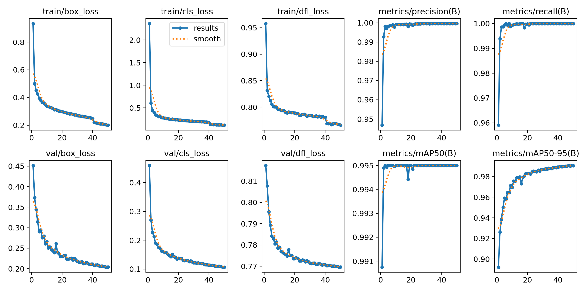

# Poker Hand Detection using YOLOv8

In this project, I used the [Roboflow Playing Cards Dataset](https://universe.roboflow.com/) to train a YOLOv8 model that can detect poker cards. After detecting the cards on the table and in the player’s hand, the `PokerHandClassification.py` script is used to calculate the current poker hand.

## 1. Card Detection with YOLOv8

I trained a YOLOv8 model on the Roboflow Playing Cards dataset to detect and classify cards.  
- Fine-tuning & training code: `YoloDetectionModel.ipynb`  
- Visualization: `PokerHandVisualization.ipynb`

**Training Details**  
- Trained for 50 epochs on Google Colab (A100 GPU)  
- Image size: 800x800  
- Optimizer: Auto  
- Batch size: 32  

**Training Results**
| Class | Images | Instances | Precision (P) | Recall (R) | mAP50 | mAP50-95 |
|-------|--------|-----------|---------------|------------|-------|----------|
| all   | 2020   | 8080      | 1             | 1          | 0.995 | 0.8157   |

📉 **Loss Curves**  
Here are the loss curves for training:

📊 **Confusion Matrix**  
Here is the confusion matrix:

---

